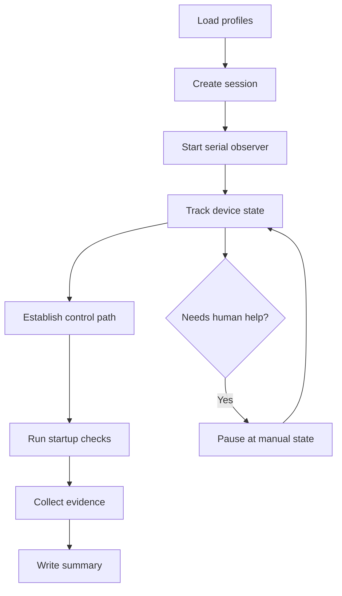

# MVP Workflow And CLI Entry

## Goal

The first version should make one thing boring and reliable:

- observe one device
- create a session
- collect baseline evidence
- produce a structured summary

## MVP Flow



## First CLI Entry

### `run`

Primary command:

```powershell
cd X:\Auto-Debug
$env:AUTO_DBG_SERIAL_PORT = "COM19"
python -m autodbg ports
python -m autodbg run
```

What it does in the scaffold:

1. loads the default profile set from `profiles/defaults.toml`
2. creates a session directory under `artifacts\YYYYMMDD\session_id`
3. writes bootstrap evidence files
4. prints the planned startup-check workflow

### `resume`

```powershell
python -m autodbg resume --session-dir .\artifacts\20260415\...
```

Use it after a manual intervention or when the host tool is restarted.

### `summary`

```powershell
python -m autodbg summary --session-dir .\artifacts\20260415\...
```

Reads `summary.json` and prints the current session snapshot.

### `observe`

```powershell
python -m autodbg observe --seconds 10
```

Captures live serial data into a fresh session and writes:

- `logs/serial.log`
- `events.jsonl`
- `summary.json`

### `exec`

```powershell
python -m autodbg exec --shell-command "ls /mnt/sdcard"
```

Attempts to:

1. reach the login prompt or root shell
2. login if needed
3. run one command with begin/end markers
4. write transcript and output artifacts into the session

## Immediate Next Implementation Targets

1. replace stub serial observer with real serial capture
2. replace stub controller with shell and agent control
3. wire task templates into real step execution
4. add deployer support for the first stable channel
