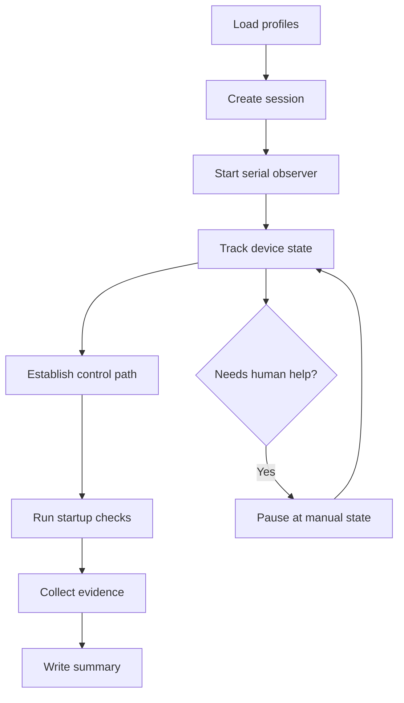
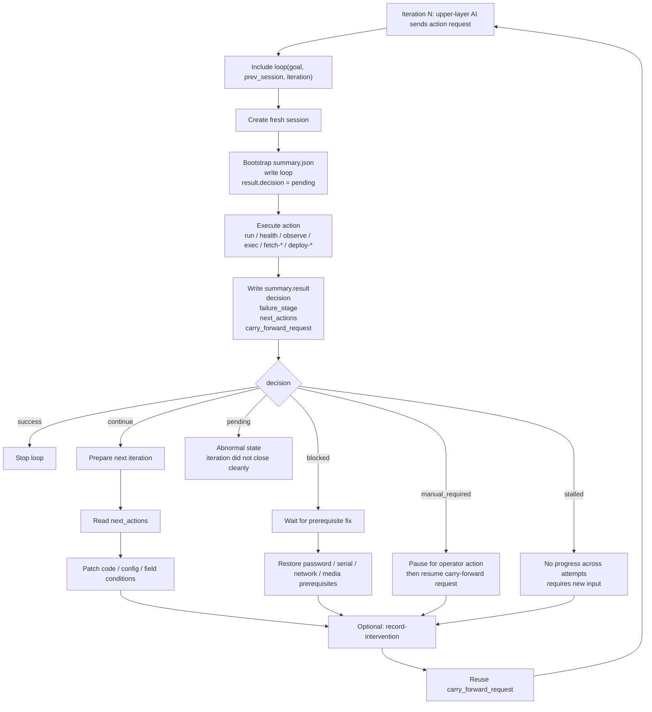

# MVP Workflow And CLI Entry

## Goal

The first version should make one thing boring and reliable:

- observe one device
- create a session
- collect baseline evidence
- produce a structured summary

## MVP Flow



## Current Multi-Iteration Loop

The current loop contract is session-driven. Each iteration writes a new `summary.json`,
then the upper-layer AI decides whether to stop, intervene, or continue based on
`summary.result`.



Current stop / pause semantics:

- `success`: stop the multi-iteration loop
- `continue`: soft break; upper-layer AI should inspect `failure_stage`, apply changes, then use `carry_forward_request`
- `blocked`: hard break; fix prerequisites first, then continue
- `manual_required`: emitted when `deploy-verify` has a build artifact but no concrete device-side apply/restart step, or when a closed loop runs without target-specific validation criteria. The caller should ask the developer for the missing manual step or validation signal, then resume from `carry_forward_request`
- `stalled`: emitted by the contract for repeated no-progress loops. Built-in commands preserve the state so upper-layer agents can stop retrying and request new evidence or human intervention
- `pending`: bootstrap default only; if it remains at the end, treat the iteration as abnormal

Common `failure_stage` breakpoints in the current implementation:

- `observe_serial`
- `establish_control`
- `baseline_checks`
- `collect_evidence`
- `validation`
- `prepare_transport`
- `run_bootstrap_commands`
- `validate_connectivity`
- `transfer_artifacts`
- `validate_transfer`
- `execute_command`
- `fetch_file`
- `fetch_path`
- `deploy_artifacts`
- `running_checks`

## Closed Deploy/Verify Loop

Use `deploy-verify` when the task is not just "check device health" but "prove this code change reached the device and fixed the reported issue".

Minimal inputs:

- `--build-command`: optional host-side build command
- `--artifact`: optional local file recorded with size and SHA256
- `--post-pull-command`: repeatable device-side deploy/apply command
- `--reboot-command`: optional device restart command
- `--observe-seconds`: serial observation window after deploy/restart
- `--validation-command`, `--expect-marker`, `--reject-marker`, `--expected-version`: target-specific success criteria

`device-pull` can also run `--post-pull-command`, `--reboot-command`, post observation, and the same validation flags after transfer. This keeps the artifact transfer path from stopping at "file copied" when the developer actually needs an upgrade-and-verify loop.

## First CLI Entry

### `run`

Primary command:

```powershell
cd <repo-root>
$env:AUTO_DBG_SERIAL_PORT = "COM19"
python -m autodbg ports
python -m autodbg run
```

What it does in the scaffold:

1. loads the default profile set from `profiles/defaults.toml`
2. creates a session directory under `artifacts\YYYYMMDD\session_id`
3. writes bootstrap evidence files
4. prints the planned startup-check workflow

### `resume`

```powershell
python -m autodbg resume --session-dir .\artifacts\20260415\...
```

Use it after a manual intervention or when the host tool is restarted.

### `summary`

```powershell
python -m autodbg summary --session-dir .\artifacts\20260415\...
```

Reads `summary.json` and prints the current session snapshot.

### `observe`

```powershell
python -m autodbg observe --seconds 10
```

Captures live serial data into a fresh session and writes:

- `logs/serial.log`
- `events.jsonl`
- `summary.json`

### `exec`

```powershell
python -m autodbg exec --shell-command "ls /mnt/sdcard"
```

Attempts to:

1. reach the login prompt or root shell
2. login if needed
3. run one command with begin/end markers
4. write transcript and output artifacts into the session

## Immediate Next Implementation Targets

1. replace stub serial observer with real serial capture
2. replace stub controller with shell and agent control
3. wire task templates into real step execution
4. add deployer support for the first stable channel
